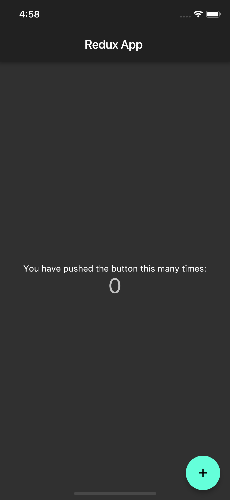

# Flutter Redux Tutorial

Redux Project is just a quick guide for implementation of redux.dart and flutter_redux . Written in dart using Flutter SDK.
Please don't forget to give stars so that i keep updating the project. Thanks

[Watch this video tutorial on Youtube](https://youtu.be/X8B-UzqEaWc)
## Getting Started

For help getting started with Flutter, view our online
[documentation](https://flutter.io/).